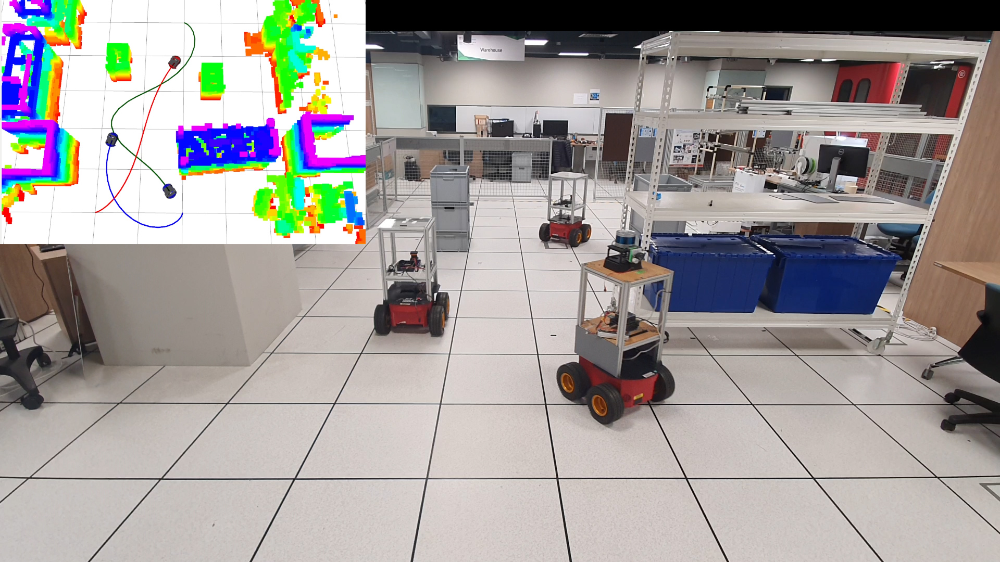
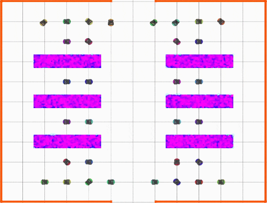

# Multi-robot Trajectory Planner

This repository contains the code for the paper:

<a href="https://ieeexplore.ieee.org/document/9293348">Efficient Trajectory Planning for Multiple Non-holonomic Mobile Robots via Prioritized Trajectory Optimization</a>

**Authors:** Juncheng Li, Maopeng Ran, and Lihua Xie from Nanyang Technological University.

Accepted in IEEE Robotics and Automation Letters (RA-L). You can find the full-text paper <a href="https://arxiv.org/abs/2012.08135">here</a>.

This paper proposes an efficient trajectory planning approach that generates safe, dynamically feasible and near-optimal trajectories
for multiple non-holonomic mobile robots in obstacle-rich environments.

Please click in the image to see our video:
<p align='center'>
<a href="https://youtu.be/GRl3LM8xBUQ">

</a>
</p>

## 1. Software Requirements
* Ubuntu 16.04
* ROS Kinetic
* Octomap
* Ipopt

## 2. Installation instructions
#### (1) Install ROS Kinetic for Ubuntu 16.04
Follow [ROS Installation](http://wiki.ros.org/ROS/Installation)

#### (2) Install Ipopt solver
Follow [Ipopt Installation](https://coin-or.github.io/Ipopt/INSTALL.html)

#### (3) Install dependencies
```
sudo apt-get install ros-kinetic-octomap*
sudo apt-get install ros-kinetic-dynamic-edt-3d
sudo apt-get install cppad
```
#### (4) Build:
```
cd ~/catkin_ws/src
git clone https://github.com/LIJUNCHENG001/multi_robot_traj_planner.git
cd ../ && catkin_make
source ~/catkin_ws/devel/setup.bash
```
## 2. Run Simulations
#### Warehouse
```
roslaunch multi_robot_traj_planner prioritized_plan_warehouse.launch 
```
<p align='center'>

</p>

#### Environment with random obstacles
```
roslaunch multi_robot_traj_planner prioritized_plan_random_env.launch
```
<p align='center'>

</p>

## 3. Simulation Configuration
You can configure the simulation settings in the launch files.

(1) Environment: The simulation environment is selected by argument 'replay_map'. The build-in maps are located in /mapfile. 

(2) Mission: The mission of the robots is selected by argument 'mission'. The build-in mission files are located in /missions.

(3) Priority Assignment: A prioritized trajectory optimization method is applied to improve the computation efficiency. If argument 'plan_random_group' is true, the priority of the robots is randomly assigned. Otherwise, a novel priority assignment method proposed in the paper is applied.

(4) Backward Movement: If argument 'backward_enable' is true, the robots are able to move backward. Otherwise, the robots can only have forward speed.


## 4. Acknowledgements

Our implementation is built on top of [libMultiRobotPlanning](https://github.com/whoenig/libMultiRobotPlanning) and [swarm_simulator](https://github.com/qwerty35/swarm_simulator). We thank Wolfgang Hönig and Jungwon Park for their great work.
